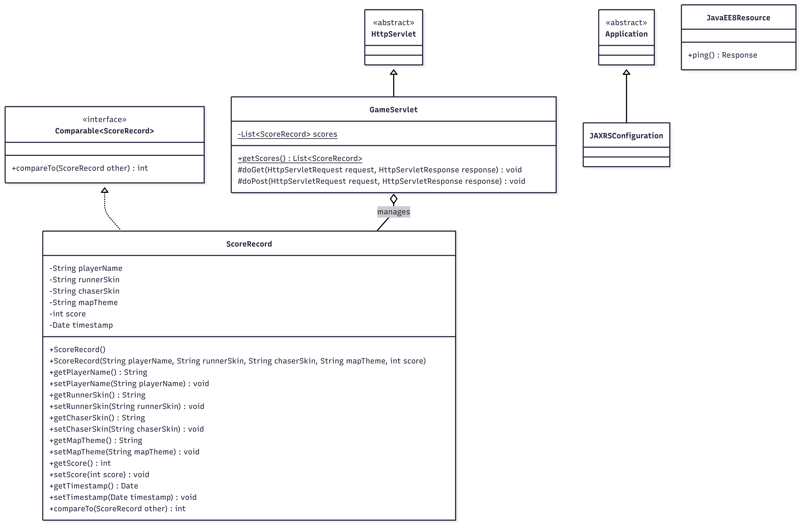

# Minority Escape

Minority Escape is a web-based mini-game developed using Java EE (Servlets and JSP). Players can customize their characters and maps, play the game, and submit their high scores to a competitive leaderboard.

## Features

- **Runner & Chaser Mechanics**
- **Dynamic Environments**
- **Leaderboard System**
- **Interactive Setup**

## Technologies Used

- **Backend**: Java 8, Java EE (Servlets)
- **Frontend**: JSP (JavaServer Pages), HTML5 Canvas, CSS, JavaScript
- **Build Tool**: Maven
- **Server**: Embedded Jetty (via Maven plugin)

## Getting Started

### Prerequisites
- Java Development Kit (JDK) 8 or higher
- Apache Maven

### Installation & Running

1. Clone the repository to your local machine.
2. Navigate to the root directory of the project (where `pom.xml` is located).
3. Run the project using the Maven Jetty plugin:
   ```bash
   mvn jetty:run
   ```
4. Open your web browser and go to `http://localhost:8085` to play the game!

**Alternative (using NetBeans):**
1. Open NetBeans.
2. Select "Open Project".
3. Go to the project folder and select it.
4. Click "Run" to start the project.

## Project Structure & Architecture

The application implements a lightweight MVC (Model-View-Controller) architecture:
- **Models**: Classes like `ScoreRecord.java` encapsulate data (player name, selected skins, themes, and score).
- **Views**: `.jsp` files (`index.jsp`, `setup.jsp`, `game.jsp`) act as the presentation layer.
- **Controllers**: `GameServlet.java` handles incoming HTTP requests, manages game setup sessions, and processes leaderboard logic.

## Class Diagram

Below is the Class Diagram depicting the overall object-oriented structure of the project:


